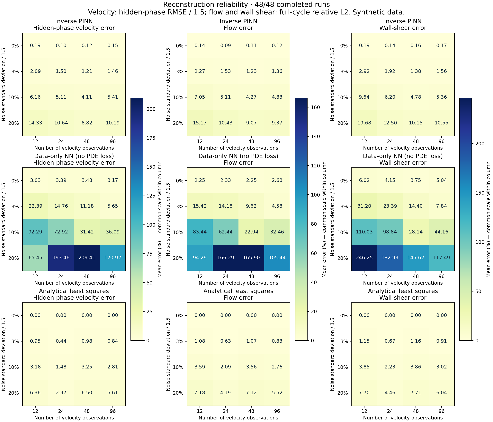

# Physics-Informed Neural Networks for Hemodynamics

**Louis Gosset · A synthetic flow-reconstruction study using physical constraints.**

Can a physics-informed neural network reconstruct velocities during an unobserved part of a periodic flow cycle? This educational project progresses from the Poiseuille profile to pulsatile flow, unknown forcing and comparisons under noisy, sparse observations.

**[Project overview](https://LGOSSET-21.github.io/pinn-hemodynamics/) · [Live demo](https://LGOSSET-21.github.io/pinn-hemodynamics/visualization/reliability.html) · [Read the report](https://LGOSSET-21.github.io/pinn-hemodynamics/reports/Project_Report.pdf)**

## Start here

- **[Project report (PDF)](reports/Project_Report.pdf)** — scientific motivation, measured results and connection to control and estimation.
- **[Reliability explorer](visualization/reliability.html)** — **[open the live explorer](https://LGOSSET-21.github.io/pinn-hemodynamics/visualization/reliability.html)**. No download or installation needed.
- [Experimental protocol and interpretation](RELIABILITY_GUIDE.md).
- [Full results table](results/reliability_v1/REPORT.md).

The explorer uses saved data and requires no Python installation. It does not retrain a model in the browser.



## Main experiment

Four observation counts (12, 24, 48, 96), four noise levels (0%, 3%, 10%, 20%) and three seeds produce **48 paired cases**. No velocity observations are provided between 30% and 65% of the cycle. Compare:

1. An inverse PINN, learning velocity and three forcing coefficients.
2. A neural network without a PDE residual, but with the same architecture and built-in boundary/periodic structure.
3. Analytical least squares using the correct harmonic solution family.

In all 16 configurations, the PINN has lower mean error than the neural baseline for hidden-phase velocity, flow and wall shear. **Analytical least squares has lower mean error than the PINN in all 16 configurations for all three metrics.** This is evidence for the value of the chosen physics constraint, not evidence that neural networks outperform classical methods on this simple problem.

## Physical assumptions and limits

Straight rigid tube; Newtonian fluid; axisymmetric fully developed periodic flow. Geometry, frequency and Womersley parameter are known. The data are entirely simulated; there is no patient data or clinical validation. The reference family matches the assumed physics, so this benchmark does not test unknown real-world model mismatch.

The study is reconstruction within a periodic cycle, not prediction of an unseen future waveform. Three seeds provide preliminary variability estimates, not universal robustness. Equal optimiser iteration budgets do not mean equal runtime or optimally tuned methods. Wall-shear accuracy must be assessed separately from velocity accuracy.

## Reproduce

Python 3.11 is recommended. Install dependencies in an isolated environment:

```bash
python3 -m venv .venv
source .venv/bin/activate
python -m pip install -r requirements.txt
python -m unittest discover -s tests -v
```

On Windows use `.venv\Scripts\activate`. For the introductory profile:

```bash
python src/poiseuille.py
```

The saved reliability study can be inspected directly. To rebuild its report:

```bash
python src/reliability_report.py
```

New training is more expensive. Read `RELIABILITY_GUIDE.md` before running `python src/reliability_study.py`. The resume mechanism checks protocol, source hashes and dependency versions. Use a new output directory (`--output`) when changing the software environment or protocol; do not overwrite the published evidence. Fitting durations include shared-CPU effects and are not controlled speed benchmarks.

## Repository contents

`src/` contains models and training scripts; `tests/` contains physical/numerical checks; `results/` retains recorded experiments; `visualization/` contains offline explorers; `reports/` contains the professor-facing note. Historical experiments are retained to support existing regression tests and provenance; the final comparison is `results/reliability_v1/`.

## Future work — not yet implemented

- Test model mismatch, not only noise generated from the assumed solution family.
- Explore more complex geometry and more realistic boundary conditions.
- Connect reconstruction to state estimation and observers before considering feedback control.
- Evaluate independent experimental data with appropriate units and uncertainty analysis.

## Authorship and references

This is Louis Gosset's learning project. AI tools assisted code development, debugging and writing. The repository distinguishes implemented experiments, measured outcomes and proposed extensions. The PINN methods are established research methods, not claimed as original inventions.

Reference: Raissi, Perdikaris & Karniadakis (2019), [Physics-informed neural networks](https://doi.org/10.1016/j.jcp.2018.10.045). A chronological [research log](RESEARCH_LOG.md) is retained; some historical learning notes and introductory code comments are in French. The README, final comparison and professor-facing report are in English.

## Companion project

[Start with the control project: triple pendulum](https://LGOSSET-21.github.io/inverted-pendulum-control/).
